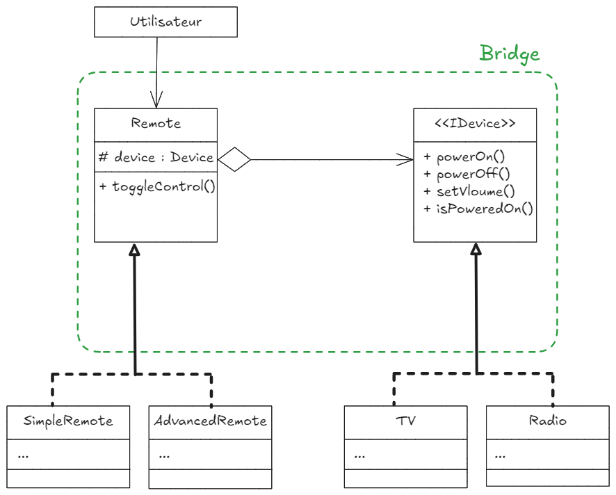

# Design Pattern Bridge - TV, Radio et Télécommandes

Ce projet illustre l'utilisation du **design pattern Bridge** en Java à travers un système de contrôle d'appareils électroniques.  
Il démontre comment séparer l'abstraction (les télécommandes) de l'implémentation (les appareils), garantissant une meilleure extensibilité et réduction du couplage.

## 📚 Présentation

### **Qu'est-ce que le Design Pattern Bridge ?**
Le pattern Bridge est un patron de conception structurel qui permet de découpler une abstraction de son implémentation, afin qu'elles puissent évoluer indépendamment.  

Dans ce projet :
- Les **télécommandes** (abstraction) contrôlent différents **appareils** (implémentation).
- Vous pouvez ajouter facilement une nouvelle télécommande ou un nouvel appareil sans modifier le code existant.

---

## ⚙️ Structure du Projet

### **Classes principales :**

1. **Interface `Device`** :  
   Déclare les fonctionnalités de base pour tout appareil électronique.  

2. **Implémentations concrètes :**  
   - `TV` : Représente un téléviseur.  
   - `Radio` : Représente une radio.  

3. **Classe abstraite `RemoteControl` (Abstraction)** :  
   Définit les fonctionnalités de base pour une télécommande, telles que l'allumage/extinction d'un appareil.  

4. **Abstractions concrètes :**  
   - `SimpleRemoteControl` : Une télécommande basique (allumer/éteindre uniquement).  
   - `AdvancedRemoteControl` : Une télécommande avancée (allumer/éteindre + réglage du volume).  

---

## 💻 Fonctionnalités

1. Contrôler des appareils (TV, Radio) avec des télécommandes différentes (Simple et Avancée).
2. Ajouter facilement de nouveaux appareils ou télécommandes sans impacter les classes existantes.
3. Réduction du couplage grâce à l'utilisation d'interfaces et d'abstractions.

---

## 🛠️ Installation et Exécution

### **Pré-requis :**
- **Java JDK 8** ou supérieur.
- Un IDE ou éditeur de texte compatible avec Java (IntelliJ, Eclipse, VS Code, etc.).

### **Étapes :**

1. Clonez le dépôt GitHub :
  ```bash
   git clone https://github.com/ElazzouziHassan/bridge-design-pattern.git
  ```
2. Importez le projet dans votre IDE préféré.

3. Exécutez la classe principale Main :
  La classe démontrera comment les télécommandes interagissent avec les appareils.

## 📁 Organisation des Fichiers

```xml
    src/
  ├── Main.java                  # Classe principale pour tester le projet
  ├── IDevice.java                # Interface pour les appareils électroniques
  ├── TV.java                    # Implémentation concrète : Téléviseur
  ├── Radio.java                 # Implémentation concrète : Radio
  ├── RemoteControl.java         # Abstraction pour les télécommandes
  ├── SimpleRemoteControl.java   # Télécommande basique
  ├── AdvancedRemoteControl.java # Télécommande avancée
```

## 🎨 Diagramme UML

Un diagramme UML complet est inclus dans la présentation PowerPoint et dans le dépôt GitHub pour mieux comprendre les relations entre les classes.



---
## 🔄 Contributions
Les contributions sont les bienvenues ! N'hésitez pas à ouvrir une issue ou une pull request pour améliorer le projet.